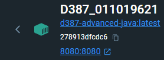
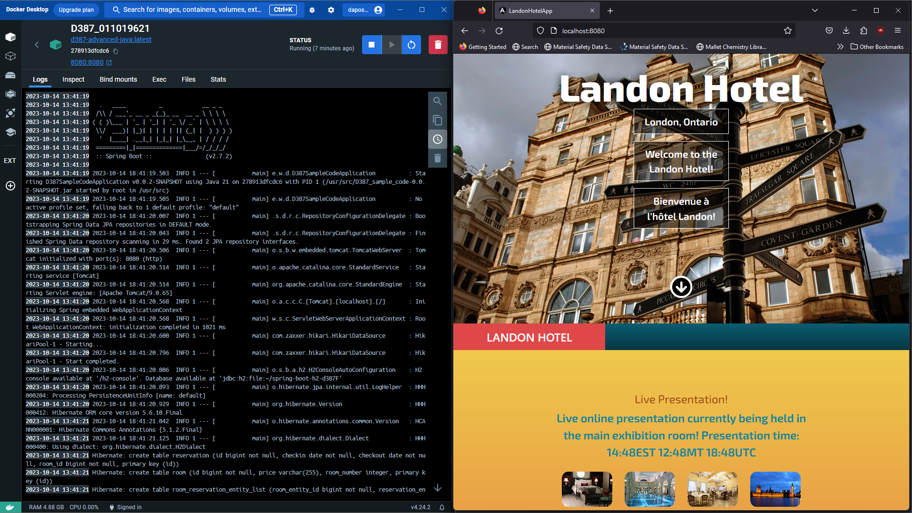
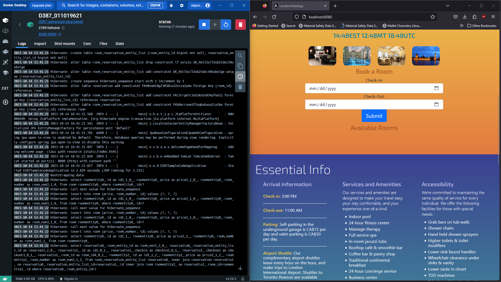
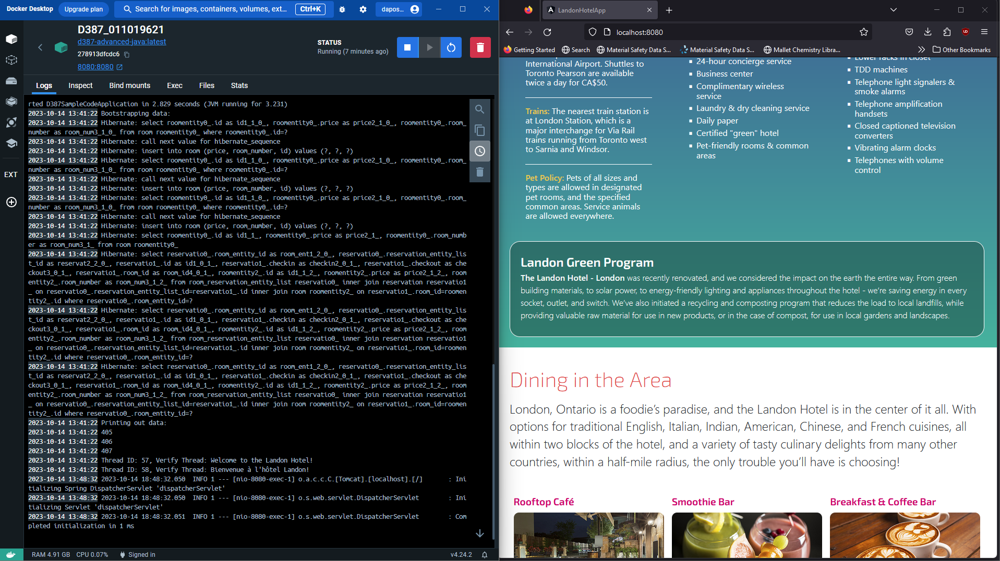

<strong> **DO NOT DISTRIBUTE OR PUBLICLY POST SOLUTIONS TO THESE LABS. MAKE ALL FORKS OF THIS REPOSITORY WITH SOLUTION CODE PRIVATE. PLEASE REFER TO THE STUDENT CODE OF CONDUCT AND ETHICAL EXPECTATIONS FOR COLLEGE OF INFORMATION TECHNOLOGY STUDENTS FOR SPECIFICS. ** </strong>

# WESTERN GOVERNOR UNIVERSITY 
## D387 – ADVANCED JAVA
Welcome to Advanced Java! This is an opportunity for students to write multithreaded object-oriented code using Java frameworks and determine how to deploy software applications using cloud services.

FOR SPECIFIC TASK INSTRUCTIONS AND REQUIREMENTS FOR THIS ASSESSMENT, PLEASE REFER TO THE COURSE PAGE.
## BASIC INSTRUCTIONS
For this assessment, you will modify a Spring application with a Java back end and an Angular front end to include multithreaded language translation, a message at different time zones, and currency exchange. Then, build a Docker image of the current multithreaded Spring application and containerize it using the supporting documents provided in this task.

## SUPPLEMENTAL RESOURCES 
1.	How to clone a project to IntelliJ using Git?

> Ensure that you have Git installed on your system and that IntelliJ is installed using [Toolbox](https://www.jetbrains.com/toolbox-app/). Make sure that you are using version 2022.3.2. Once this has been confirmed, click the clone button and use the 'IntelliJ IDEA (HTTPS)' button. This will open IntelliJ with a prompt to clone the proejct. Save it in a safe location for the directory and press clone. IntelliJ will prompt you for your credentials. Enter in your WGU Credentials and the project will be cloned onto your local machine.  

2. How to create a branch and start Development?

- GitLab method
> Press the '+' button located near your branch name. In the dropdown list, press the 'New branch' button. This will allow you to create a name for your branch. Once the branch has been named, you can select 'Create Branch' to push the branch to your repository.

- IntelliJ method
> In IntelliJ, Go to the 'Git' button on the top toolbar. Select the new branch option and create a name for the branch. Make sure checkout branch is selected and press create. You can now add a commit message and push the new branch to the local repo.

## SUPPORT
If you need additional support, please navigate to the course page and reach out to your course instructor.
## FUTURE USE
Take this opportunity to create or add to a simple resume portfolio to highlight and showcase your work for future use in career search, experience, and education!

## Rubric Sections
B.  Modify the Landon Hotel scheduling application for localization and internationalization by doing the following:

1.   Install the Landon Hotel scheduling application in your integrated development environment (IDE). Modify the Java classes of application to display a welcome message by doing the following:

a.  Build resource bundles for both English and French (languages required by Canadian law). Include a welcome message in the language resource bundles.
1) Create Resource Bundle "welcome".
2) Create welcome.properties, welcome_en_US.properties, and welcome_fr_CA.properties.
3) Add "hello" and "welcome" messages in English in the welcome_en_US.properties file.
4) Add "hello" and "welcome" messages in French in the welcome_fr_CA.properties file.

b.  Display the welcome message in both English and French by applying the resource bundles using a different thread for each language.
1) Create ShowWelcomeMessage.java file containing method to get welcome messages.
2) Create WelcomeMessageController.java file for API responses with ShowWelcomeMessage.java.
3) Modify D387SampleCodeApplication.java, Lines 7-9 & Lines 15-26: Add new imports & implement thread creation for English and French.
4) Modify app.component.ts, Lines 18-21: Create message variables for welcome messages in English and French
5) Modify app.component.ts, Lines 38-41: Add HTTP GET requests and print welcome messages in both English and French to the console when received.
6) Modify app.component.html, Lines 8-12: Add English and French messages to html Frontend to Display to User when opening the app.

Note: You may use Google Translate for the wording of your welcome message.

2.  Modify the front end to display the price for a reservation in currency rates for U.S. dollars ($), Canadian dollars (C$), and euros (€) on different lines.
1) Modify app.component.ts, Lines 111-112: Add priceCAD and priceEUR variables.
2) Modify app.component.ts, Lines 57-63: Create conversion between USD, CAD and EUR.
3) Modify app.component.html, Lines 83-85: Add CAD and EUR prices to html frontend.

Note: It is not necessary to convert the values of the prices.

3.  Display the time for an online live presentation held at the Landon Hotel by doing the following:

a.  Write a Java method to convert times between eastern time (ET), mountain time (MT), and coordinated universal time (UTC) zones.
1) Create TimeZoneConversion.java class that holds method to convert times between eastern time (ET), mountain time (MT), and coordinated universal time (UTC) zones.
2) Create TimeZoneConversionController.java file to handle API responses for time zone conversions.

b.  Use the time zone conversion method from part B3a to display a message stating the time in all three times zones in hours and minutes for an online, live presentation held at the Landon Hotel. The times should be displayed as ET, MT, and UTC.
1) Modify TimeZoneConversionController.java, Lines 14-17: Add message to display when Controller is activated.
2) Modify app.component.ts, Lines 22-24: Create variable to show time zones.
3) Modify app.component.ts, Lines 44-46: Add HTTP get request to print out live presentation banner to the console when received.
4) Modify app.component.html, 35-37: Add Presentation message with EST, MT and UTC times to html frontend.
C.  Explain how you would deploy the Spring application with a Java back end and an Angular front end to cloud services and create a Dockerfile using the attached supporting document "How to Create a Docker Account" by doing the following:

1.  Build the Dockerfile to create a single image that includes all code, including modifications made in parts B1 to B3. Commit and push the final Dockerfile to GitLab.
1) Create Dockerfile
2.  Test the Dockerfile by doing the following:

•   Create a Docker image of the current multithreaded Spring application.
1) Create Docker image by creating jar files and running in Dockerfile.

•   Run the Docker image in a container and give the container a name that includes D387_[student ID].

•   Submit a screenshot capture of the running application with evidence it is running in the container.

3.  Describe how you would deploy the current multithreaded Spring application to the cloud. Include the name of the cloud service provider you would use.

As I would like to eventually gain the AWS Certified Cloud Practitioner certification, I'll be choosing AWS as the cloud service provider.

First we would need to create a Dockerfile to hold our image, but make it read from the environment rather than hardwire it to a port, as we wouldn't know the 
availability of the port at any given on any given computer or network. To do this, we would go to our angular files (app.component.ts), add the necessary imports, 
and switch the baseURL from being a port to instead having it set to a location path, so for example: from "http://localhost:8080" to "this.location.path()". 
Then, we would need to create our jar file of the multithreaded Spring application by cleaning and packaging the application via Maven. 
We would then copy that jar file into a base image that contains the Java Development Kit (or Java Runtime Environment) and run our Dockerfile.
From there we would create the container so that we could run the image in the container. Once we confirmed that the container was working as intended, we would then
want to push this Docker Hub. We would get our account, access token, create a repository on Docker Hub and push our image to our repository.

The next part would be to log into AWS and set up an IAMS (Identity and Access Management) account in order to manage the necessary permissions.
Our next step then is to launch an EC2 linux instance, or virtual machines(VM), that runs on AWS Cloud. Our next step would be to start an AWS session via session manager
and utilize our previously created instance and install Docker into our instance. Finally, we would pull our image from Docker Hub and deploy it in a container,
thus successfully deploying the application to the cloud for multiple users to use.

Note: Remember to commit and push your changes to GitLab.