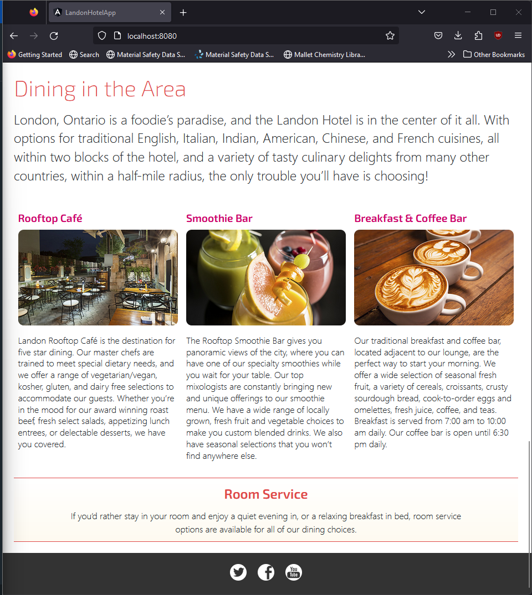

## Hotel Scheduling Application
The purpose of this project was to create a hotel scheduling application that allowed users to reserve rooms based on time and dates, while simultaneously providing information in English and French. The project was imaged and containerized for future deployment to the cloud utilizing Docker.

## Languages and Tools
This project used Java, Spring Boot, Angular, Docker, HTML and CSS.
## Commit History

Implemented localization and internationalization for the application
1) Create Resource Bundle "welcome".
2) Create welcome.properties, welcome_en_US.properties, and welcome_fr_CA.properties.
3) Add "hello" and "welcome" messages in English in the welcome_en_US.properties file.
4) Add "hello" and "welcome" messages in French in the welcome_fr_CA.properties file.

Displayed the welcome message in both English and French by applying the resource bundles using a different thread for each language.
1) Create ShowWelcomeMessage.java file containing method to get welcome messages.
2) Create WelcomeMessageController.java file for API responses with ShowWelcomeMessage.java.
3) Modify D387SampleCodeApplication.java, Lines 7-9 & Lines 15-26: Add new imports & implement thread creation for English and French.
4) Modify app.component.ts, Lines 18-21: Create message variables for welcome messages in English and French
5) Modify app.component.ts, Lines 38-41: Add HTTP GET requests and print welcome messages in both English and French to the console when received.
6) Modify app.component.html, Lines 8-12: Add English and French messages to html Frontend to Display to User when opening the app.

Modified the front end to display the price for a reservation in currency rates for U.S. dollars ($), Canadian dollars (C$), and euros (€) on different lines.
1) Modify app.component.ts, Lines 111-112: Add priceCAD and priceEUR variables.
2) Modify app.component.ts, Lines 57-63: Create conversion between USD, CAD and EUR.
3) Modify app.component.html, Lines 83-85: Add CAD and EUR prices to html frontend.

Displayed the time for an online live presentation

Wrote a Java method to convert times between eastern time (ET), mountain time (MT), and coordinated universal time (UTC) zones.
1) Create TimeZoneConversion.java class that holds method to convert times between eastern time (ET), mountain time (MT), and coordinated universal time (UTC) zones.
2) Create TimeZoneConversionController.java file to handle API responses for time zone conversions.

Displayed a message stating the time in all three times zones in hours and minutes for an online, live presentation held at hotel. The times displayed as ET, MT, and UTC.
1) Modify TimeZoneConversionController.java, Lines 14-17: Add message to display when Controller is activated.
2) Modify app.component.ts, Lines 22-24: Create variable to show time zones.
3) Modify app.component.ts, Lines 44-46: Add HTTP get request to print out live presentation banner to the console when received.
4) Modify app.component.html, 35-37: Add Presentation message with EST, MT and UTC times to html frontend.
C.  Explain how you would deploy the Spring application with a Java back end and an Angular front end to cloud services and create a Dockerfile using the attached supporting document "How to Create a Docker Account" by doing the following:

Built the Dockerfile to create a single image that included all of the code for the application.
1) Create Dockerfile

Ran the Docker image in a container.

Screenshot capture of the running application with evidence it is running in the container.

## Future Cloud Deployment

As I would like to eventually gain the AWS Certified Cloud Practitioner certification, I'll be choosing AWS as the cloud service provider.

First we would need to create a Dockerfile to hold our image, but make it read from the environment rather than hardwire it to a port, as we wouldn't know the 
availability of the port at any given on any given computer or network. To do this, we would go to our angular files (app.component.ts), add the necessary imports, 
and switch the baseURL from being a port to instead having it set to a location path, so for example: from "http://localhost:8080" to "this.location.path()". 
Then, we would need to create our jar file of the multithreaded Spring application by cleaning and packaging the application via Maven. 
We would then copy that jar file into a base image that contains the Java Development Kit (or Java Runtime Environment) and run our Dockerfile.
From there we would create the container so that we could run the image in the container. Once we confirmed that the container was working as intended, we would then
want to push this Docker Hub. We would get our account, access token, create a repository on Docker Hub and push our image to our repository.

The next part would be to log into AWS and set up an IAMS (Identity and Access Management) account in order to manage the necessary permissions.
Our next step then is to launch an EC2 linux instance, or virtual machines(VM), that runs on AWS Cloud. Our next step would be to start an AWS session via session manager
and utilize our previously created instance and install Docker into our instance. Finally, we would pull our image from Docker Hub and deploy it in a container,
thus successfully deploying the application to the cloud for multiple users to use.
